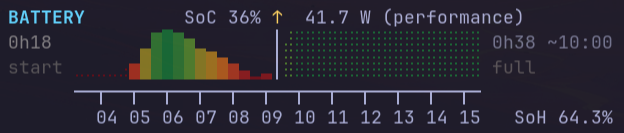

# battery-status-tui

`battery-status-tui` is a compact, standalone battery monitor for Linux. It
records low-overhead local history, separates charging and discharging sessions,
reconstructs suspend and hibernate gaps, and renders twelve hours of context —
measured history and a forecast that reaches the predicted full/empty time —
in five lines of terminal output.

It uses only the Python standard library, needs no root, and runs no
system-wide daemon. History lives in a single SQLite file in your XDG state
directory and is never uploaded.

The project is deliberately independent from any dashboard or shell widget; a
dashboard can consume its database later without coupling to the collector.

## Features

- One glance: current SoC, charge/discharge direction, power draw, ETA,
  State-of-Health, and active power profile.
- A graph up to 12 h wide on a stable 20-minute grid: a dynamic `NOW` marker
  with history on the left and a forecast on the right sized to the ETA.
- Honest history: measured time, proven sleep/hibernate time, and unknown gaps
  are visually distinct. Known data is always visible; blank means unknown.
- Field-level fusion of `/sys/class/power_supply` and UPower, with a layered
  power resolver that marks estimates as approximate.
- Robust ETA from a Theil–Sen session trend, not a single instantaneous rate.
- Crash-safe schema-v4 storage: append-only event log, immutable hourly
  aggregates, rotating verified checkpoints, and automatic recovery.
- Suspend/hibernate reconstruction from clocks and the kernel journal —
  including hibernation across a cold boot.

## Requirements

- Linux with `/sys/class/power_supply` **and/or** UPower (`upower` CLI).
- Python 3.11 or newer, plus `pip` for installation. The application itself has
  no third-party runtime packages.
- A terminal with Unicode (block + Braille glyphs, and emoji for the
  power-profile face) and 24-bit color for the graph. Check yours with
  `battery-status-tui --unicode-probe`.
- Optional, each degrades gracefully if absent:
  - `journalctl` — durable suspend/hibernate reconstruction;
  - `powerprofilesctl` / `busctl` / `/sys/firmware/acpi/platform_profile` —
    power-profile display.

## Installation

From a release archive or Git checkout, install the existing console entry
point into your user prefix:

```bash
cd battery-status-tui
if [ -L ~/.local/bin/battery-status-tui ]; then rm ~/.local/bin/battery-status-tui; fi
python3 -m pip install --user .
test -x ~/.local/bin/battery-status-tui
```

Ensure `~/.local/bin` is on `PATH`. No root access is needed.
The conditional removal only clears the pre-1.0 development symlink, if one is
present; it never removes an installed regular executable.

### Background sampling

The canonical collector is a user timer that runs one short-lived `--sample`
process per minute:

```bash
install -Dm644 systemd/battery-status-tui.service ~/.config/systemd/user/battery-status-tui.service
install -Dm644 systemd/battery-status-tui.timer ~/.config/systemd/user/battery-status-tui.timer
systemctl --user daemon-reload
systemctl --user enable --now battery-status-tui.timer
```

The service executes `~/.local/bin/battery-status-tui --sample`. Inspect it with
`systemctl --user status battery-status-tui.timer` and
`journalctl --user -u battery-status-tui.service`.

To update from a newer checkout or release archive:

```bash
python3 -m pip install --user --upgrade .
install -Dm644 systemd/battery-status-tui.service ~/.config/systemd/user/battery-status-tui.service
install -Dm644 systemd/battery-status-tui.timer ~/.config/systemd/user/battery-status-tui.timer
systemctl --user daemon-reload
systemctl --user restart battery-status-tui.timer
```

To remove just this:

```bash
systemctl --user disable --now battery-status-tui.timer
rm ~/.config/systemd/user/battery-status-tui.{service,timer}
systemctl --user daemon-reload
python3 -m pip uninstall battery-status-tui
```

Nothing is installed or enabled automatically. Continuous history requires the
timer (or an equivalent regular `--sample` invocation). It is the sole writer;
ordinary viewers never collect or modify the database.

## Quick start

```bash
battery-status-tui              # interactive read-only viewer
battery-status-tui --once       # read-only dashboard, then exit
battery-status-tui --sample     # collect and record one sample
battery-status-tui --diagnose   # detailed source and health readout
```

When stdout is not a terminal, the program renders once and exits, so
`battery-status-tui | cat` and cron-style capture work without a flag.

## CLI options

| Option | Effect |
|---|---|
| *(none)* | Read-only interactive dashboard; redraws committed SQLite state every `--interval` seconds. `Ctrl-C` to exit. |
| `--once` | Print one read-only dashboard from the latest checkpoint and exit. |
| `--sample` | Take one sample, print a single terse line (`<epoch> <soc>% <state> <power>`), exit. Used by the systemd timer. |
| `--interval SECONDS` | Interactive refresh interval (default `60`). |
| `--database PATH` | Use an alternate SQLite history file (default `${XDG_STATE_HOME:-~/.local/state}/battery-status-tui/history.sqlite3`). |
| `--diagnose` | Inspect live sources and print power, health, session, identity, and database details without collecting or modifying the history database. |
| `--unicode-probe` | Print the block/Braille/profile/axis glyphs the renderer uses, to verify terminal font support. |
| `--version` | Print the version and exit. |

`--once`, `--sample`, `--diagnose`, and `--unicode-probe` are mutually
exclusive.

## Reading the graph

```
BATTERY                 SoC 72% ↓  12.4 W 😎
0h48             ▁▂▂▂▂▂▂▂▃▃▃▃▃▃▃│⣀          3h10 ~18:20
start            ███████████████│⣿⣿⣷⣶⣦⣤⣀⣀⣀⣀ empty
      ──┬──┬──┬──┬──┬──┬──┬──┬──┬──┬──┬──┬─
        07 08 09 10 11 12 13 14 15 16 17 18   SoH 94.3%
```

- **Up to 12 hours, dynamic `NOW`.** 37 columns of 20 minutes each. The `NOW`
  column (`│`) is not fixed: the forecast to its right is only as wide as it
  needs to be to reach the predicted `full`/`empty` time, and everything else
  is history to its left. A short ETA pushes `NOW` right and shows more past; a
  long ETA pulls it left; with no ETA `NOW` sits at the right edge. The grid is
  aligned to absolute clock boundaries and the title arrow sits above `NOW`.
- **Observed solid history** — block characters `▁`–`█`, gradient-colored by
  SoC. This is time the collector was awake and measuring.
- **Sleep / hibernate** — Braille cells in the history region, SoC interpolated
  between the readings before and after a *proven* suspend/hibernate span.
- **Forecast** — Braille cells right of `NOW`, ending on the predicted time.
- **Unknown gaps** — blank. The collector was not running, or continuity broke
  with no sleep evidence.
- **Known low SoC vs unknown.** Every measured history bucket shows at least
  the smallest block `▁`, using its actual SoC color; exact 0% is deep red
  `#550A14`. Valid sleep and forecast trajectories at 0% keep a bottom Braille
  dot. Only genuinely-unknown cells are blank. The rule throughout: *known data
  stays visible; empty means no reliable data.*
- **Forecast direction.** A discharge forecast runs down to 0% at the predicted
  empty time (deep red `#550A14`); a charge forecast runs up to a full column
  at the predicted full time. The forecast never reverses direction.
- **Color gradient.** `#550A14` at 0% → `#9B231E` at 25% → `#AF6E19` at 50% →
  `#5A8228` at 75% → `#146932` at 100%, linearly interpolated.
- **`start` / `full` / `empty` / ETA.** Left of the rows: time since the current
  session began, labelled `start`. Right: the estimated remaining time and
  target clock time (`~HH:MM`), labelled `full` when charging or `empty` when
  discharging. `--` when there is no estimate.
- **SoH.** `SoH X.X%` on the label line when a State-of-Health value can be
  resolved from capacity vs. design capacity.
- **Power profile.** An emoji face after the power reading when
  power-profiles-daemon or the kernel platform profile is available: 🥵
  performance, 😎 balanced, 😴 power-saver. Missing or unrecognized shows no
  face.
- **Power source.** `X.X W` is a direct reading; `~X.X W` is a time-derived
  estimate; `-- W` means no usable value. sysfs is preferred, UPower fills gaps,
  and a UPower-only snapshot is used if sysfs is unavailable.

Full details: [docs/graph.md](docs/graph.md).

## Screenshots



## Limitations

- Linux only; needs sysfs power-supply data or UPower.
- `--sample` is the sole writer. Multiple ordinary viewers are safe, but two
  sampling processes against one database are unsupported.
- Without the timer or another regular `--sample`, history stops advancing and
  the viewer reports stale data rather than presenting it as current.
- The graph needs a Unicode + 24-bit-color terminal; without them it is
  unreadable (use `--diagnose` for plain text).
- Suspend/hibernate is classified as *sleep* only with positive evidence
  (clock discontinuity or journal record). Without it, a gap stays *unknown*
  by design.
- ETA needs a few minutes of consistent trend before it appears; brief spikes
  are rejected rather than smoothed.
- Time-derived power (`~X.X W`) needs at least two minutes of matching awake
  history.
- A pre-1.0 development database (schema v2) is not migrated automatically; see
  [docs/migration.md](docs/migration.md).

## Documentation

- [docs/architecture.md](docs/architecture.md) — schema-v4 storage: event log,
  hourly aggregates, checkpoints, WAL, recovery, backups.
- [docs/history-model.md](docs/history-model.md) — observed/sleep/unknown
  semantics, sessions, suspend/hibernate reconstruction, battery identity,
  health events.
- [docs/graph.md](docs/graph.md) — exact geometry, colors, and rendering rules.
- [docs/data-sources.md](docs/data-sources.md) — sysfs/UPower field fusion and
  the power resolver.
- [docs/estimation.md](docs/estimation.md) — the Theil–Sen ETA and forecast
  display.
- [docs/storage.md](docs/storage.md) — database location, privacy, overhead.
- [docs/migration.md](docs/migration.md) — converting a pre-1.0 database.
- [CHANGELOG.md](CHANGELOG.md)

## Development

```bash
PYTHONPATH=src python3 -m unittest discover -s tests -v
python3 -m compileall -q src tests
git diff --check
```

The suite covers energy- and charge-based batteries, multi-battery aggregation,
source priority and invalid zeroes, counter resets and replacement batteries,
schema-v4 storage and recovery, suspend/hibernate reconstruction (including
cold-boot hibernation), session boundaries, forecast and 0%-visibility
rendering, the pre-1.0 converter and its independent validator, and the
schema-dispatch behavior of the CLI.

### Simulating the dashboard

`battery_status_tui.simulate` renders the dashboard from a scenario so you can
eyeball graph behaviour without waiting for a real battery event. It drives the
real production renderer and estimator with in-memory model objects and shows a
`SIMULATION` heading so the output is never mistaken for the live dashboard. It
never starts a collector, timer, or systemd unit.

```bash
# synthetic: measured history -> a proven 6 h sleep dropping SoC 97% -> 40% -> resume
PYTHONPATH=src python3 -m battery_status_tui.simulate sleep-drop
PYTHONPATH=src python3 -m battery_status_tui.simulate sleep-drop \
    --start-soc 100 --resume-soc 25 --sleep-hours 8 --after discharging

# --simulate: keep the genuine live graph, then append a hypothetical timeline
PYTHONPATH=src python3 -m battery_status_tui.simulate sleep-drop \
    --simulate 2h=50% 3h:sleep=-20% 1h:nodata 45m=82% ac
PYTHONPATH=src python3 -m battery_status_tui.simulate sleep-drop \
    --simulate 35m=-4% 3h12m:sleep=-28% 27m=+8% 1h18m:nodata=-12% 2h05m=82% ac=24.2w
```

**Synthetic mode** builds `sleep-drop` from scratch in memory — no
battery-history database is opened, read, written, or created (there is no
`--database` option), and output is deterministic.

**`--simulate`** anchors to the genuine live dashboard and appends a sequential
timeline. Grammar:

```
--simulate <duration>[:<type>][=<soc>] ...  [ac[=<watts>w] | dc[=<watts>w]]
```

| Token part | Meaning |
|---|---|
| `<duration>` | `2h` `1h24m` `45m` `90s` `2h05m` — measured from the *previous* checkpoint, not the original NOW; positive; may be shorter than one 20-minute column |
| `:sleep` | a known sleep/suspend interval — the locked colour-gradient Braille reconstruction between the known endpoints |
| `:nodata` | endpoints known, trajectory not — a straight-line Braille connection drawn in **neutral light gray** (never the SoC gradient), visually distinct from `:sleep`. Genuine history gaps with no reliable later endpoint stay blank. |
| *(no type)* | an ordinary active interval whose SoC trajectory is drawn from the endpoints |
| `=82%` / `=100%` | end at that **absolute** SoC |
| `=-20%` / `=+30%` | change the preceding SoC by that many **percentage points** (clamped 0–100; absolute outside 0–100 is rejected) |
| *(no `=soc`)* | SoC unchanged across the block |
| final `ac` / `dc` | power-source context at the fictitious NOW; omitted → keep the genuine live context. The genuine live power magnitude is the default rate (even when the context is reversed); a genuine `None` stays `None`. |
| final `ac=24.2w` / `dc=8.3w` | plus an explicit battery-power magnitude (positive, finite, > 0) for the fictitious NOW |

The genuine history and its real Measurement values, irregular SoC, colour
gradient, existing sleeps, session, battery identity, health and power profile
are kept **verbatim**; only the future blocks are synthetic. The end of the last
block is the fictitious NOW; state and forecast there come from the **production
estimator** (the simulator never computes its own ETA). The total simulated
timeline must fit the graph's history window (`graph.MAX_SPAN_SECONDS`, 12 h) or
the command is rejected before rendering — nothing is truncated or rescaled.

The production database is read **once, read-only** (`mode=ro`,
`PRAGMA query_only=ON` — writing is technically impossible); a missing database
is reported, never created; no writer, migration, checkpoint or metadata path is
touched. The independently running collector keeps writing genuine data and is
unaffected.

## License

MIT — see [LICENSE](LICENSE).
